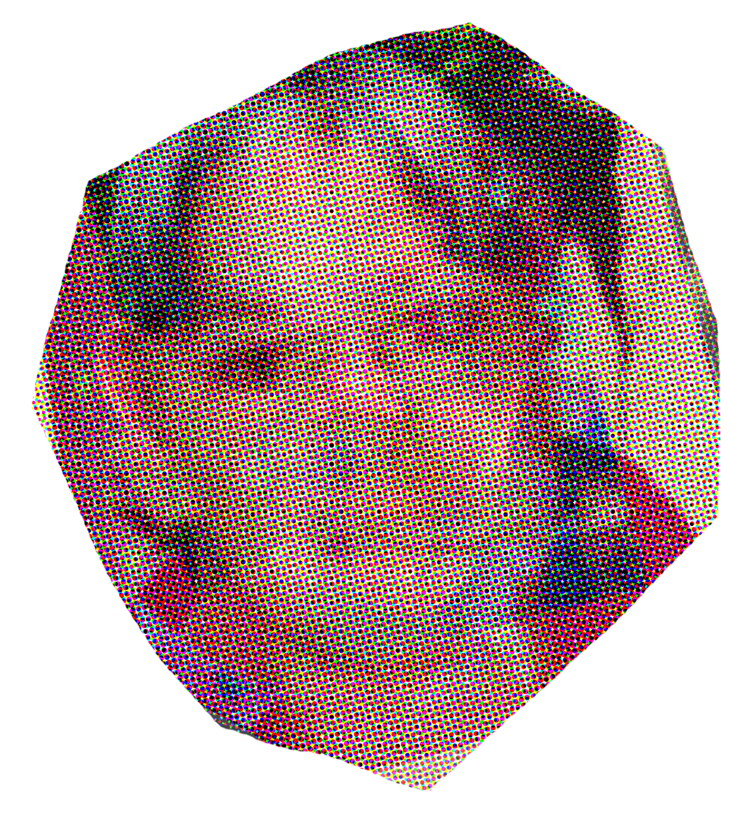
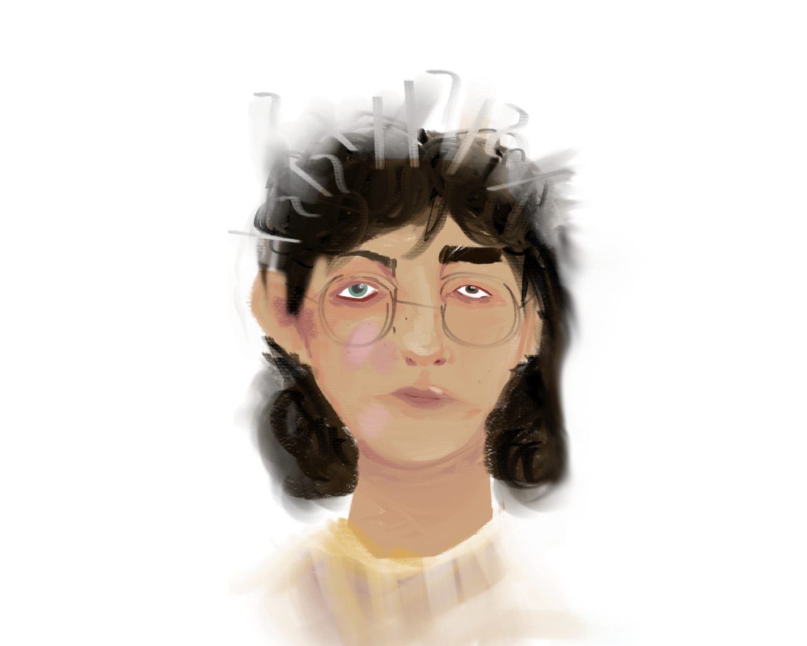
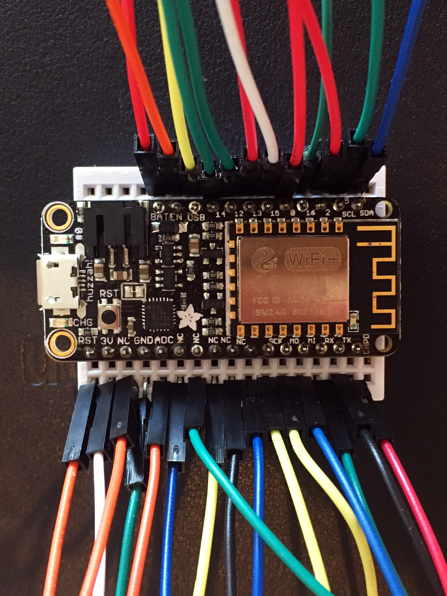

# The Other Townsend

This is part of a project made for the BioDesign Challenge in 2019. 

| request | response |
|-------  |-------- |
| Title | The Other Townsend |
| Names of students | Marley Townsend |
| Final presentation | [PDF](https://www.dropbox.com/s/cb74f7us4s6a0g7/MarleyTownsend_CalArts_BDC2019_final.pdf?dl=0) |
| Video files | NA |


## Project Description

"The Other Townsend" is a fictitious person--a new sibling--made from personal and biological data collected online from my family. This critical and aesthetic response demonstrates how little major corporations know us, reflects on how damaging this practice might be and offers some ideas about how to protect ourselves in the future.

I manually tracked my family's mood, sleep patterns, physical locations, genetics, and browsing history over seven days to formulate a life for my new sibling. I used this information to make both an image portrait and a data portrait. My new sibling is an example of what companies (Amazon, Verily/Google, Gyroscope, Facebook) think we are. It is a "police sketch" of a person made entirely of stolen data. 

By doing this work manually, I wanted to prove that the subjectivity of human health, mentality, interests, fears, and relationships are uncapturable by data. These corporations are both invading our privacy and failing to capture anything real about us. They are doing this without considering possible consequences.

"The Other Townsend" lives in a computer, with a Telegram chatbot interface for people at https://t.me/OtherTownsendBot.


## Links
- [Telegram Bot](https://t.me/OtherTownsendBot)
- [Website](https://theothertownsend.com)
- [Code](https://github.com/calarts/othertownsend)
- [CalArts blog post](http://blog.calarts.edu/2019/06/05/calartian-competes-in-2019-biodesign-challenge-summit/)


## High-resolution images




---



---



---


---


## @theothertownsend
This code lives on a server at Digital Ocean and serves up files for a Telegram bot, [t.me/OtherTownsendBot](https://t.me/OtherTownsendBot)

The Other can answer a few questions. Try asking them:


 - How are you feeling?
 - How did you sleep?
 - Where are you?
 - What have you been looking at?


They also accept these commands:

```
/start
/set <n seconds>			# get OT updates every <n seconds>
/unset						# unset automatic updates
/loc						# get current location
/feeling					# an iconic report of current mood
/sleep						# an iconic report of how they slept
```


## @devothertowbsend
The dev bot lives here: [https://t.me/devothertowbsend_Bot](t.me/devothertowbsend_Bot) and their commands are much the same:

```
/start
/set <n seconds>			# get OT updates every <n seconds>
/unset						# unset automatic updates
/loc						# get current location
/feeling					# an iconic report of current mood
/sleep						# an iconic report of how they slept
/shop						# what they are shopping for
```

We are adding an proactive healthcare interface to monitor:

 - weight
 - blood pressure
 - ECG (electrocardiogram)
 - atrial fibrillation
 - blood sugar levels (hyperglycemia and hypoglycemia)
 - calories consumed
 - steps taken

 Data may be uploaded via a WiFi and cellular networks to proactive healthcare and insurance providers.


## initial setup

```
git clone https://github.com/douglasgoodwin/othertownsend.git devothertowbsend ; 
cd othertownsend

mkdir logs

sudo chgrp -R www-data .
sudo chmod -R g+rw .

cp _config.py.example _config.py AND PUT A REAL TELEGRAM TOKEN INSIDE

virtualenv -p python3 venv ;
. venv/bin/activate ;
pip install -r requirements.txt

# add an entry to supervisor like this

	[program:devothertowbsend]
	command=/home/dgoodwin/devothertowbsend/venv/bin/python ticker.py \
		-b 127.0.0.1:8002 \
		-w 1 \
		--timeout=60 \
		--graceful-timeout=60 \
		--max-requests=1024
	directory=/home/dgoodwin/devothertowbsend/
	pythonpath=/home/dgoodwin/devothertowbsend/venv
	user=root
	redirect_stderr=True
	stdout_logfile=/home/dgoodwin/devothertowbsend/logs/gunicorn.log
	stderr_logfile=/home/dgoodwin/devothertowbsend/logs/gunicorn_err.log
	autostart=true
	autorestart=true
	startsecs=10
	stopwaitsecs=10
	priority=999

sudo supervisorctl reload 
```